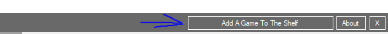

## Digital Game Shelf

A place to store shortcuts to your favourite games!

## How To Use:

Load the program and click 'Add A Game To The Shelf'

Type in the game directory where to find the Game.

Type in the game name the game name IN THE DIRECTORY.

Click 'Add Game To Shelf'

Click OK and reload the program.

The game should now be listed in the shelf.

## Run A Shortcut

Click the shortcut name or type the shorcut name in the 'Game' text box.

Click Launch!

The game should now start! Enjoy using DSG!
